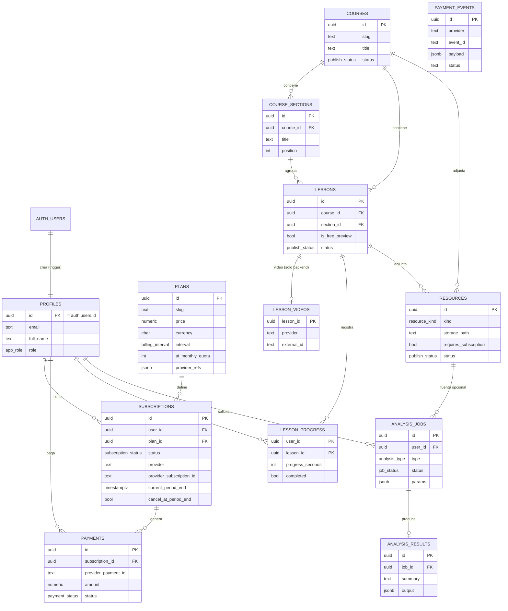

# Diagrama de entidades (Fase 1)

## Quién escribe qué

| Tabla | Lectura | Escritura |
|-------|---------|-----------|
| profiles | propio / admin | solo `full_name` (propio) |
| plans | público (activos) | admin |
| subscriptions, payments | propio / admin | **solo service_role** (webhooks/FastAPI) |
| payment_events | nadie | **solo service_role** |
| courses, sections, lessons | público si está publicado | admin |
| lesson_videos | admin | admin / service_role |
| lesson_progress | propio | propio |
| resources | suscriptor activo / admin | admin |
| analysis_jobs, analysis_results | propio / admin | **solo service_role** (cuotas) |
